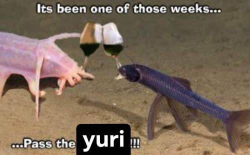

# YURI!!!

i am contributing to the problem.



# FAQ

## What is the problem

too many shader languages. they all suck.
the solution is to stop using shader languages
and just port a general-purpose language to a spir-v target


## What are you doing about it

another shader language that also sucks.
why have complex shader when can have simple shader?

...but mostly because SDLSL isn't done yet

...and I'm too stupid to contribute


## Why the hell would you do that

anger. spite. stupid? stupid.


## Why did you call it "yuri"

i like women

# Details

Yuri is inspired by lisp and lisp-like languages,
because they are easy to write parsers for.

Yuri is also very simple.
There are some things you simply cannot do in yuri.
Usually my reasoning is "I did not want to implement that."

Here's something you can't do in yuri: **you can't mutate variables.** at all. 
this is a feature.

## Program Structure

I didn't like the rigid nature of GLSL, and HLSL scares me (microsoft),
so I wanted to make sure that yuri supported modular programs.

Yuri only supports 2 shader stages, vertex and fragment.
I will implement the others if I ever need them, which is unlikely.
Compute would be the most likely, but with what I do, geometry/tesselation
is probably not happening.

Simple fragment and vertex shaders have simple outputs;
fragment shaders output color, vertex shaders output position
(as well as whatever else you want them to).

### Modules

A 

### Fragment Shaders

For fragment shaders, I am ignoring a few things:

- point rendering exists, but I simply don't care
- you can have multiple color attachments, but I simply don't
- you can modify the depth buffer with gl_FragDepth, but I won't

Here is what I'm not ignoring:

- a color attachment output (return value of the function)
- window-space fragment coordinates (but only the first 3 components)
- whether the current triangle is front-facing

Builtins:
let @frag.coord: f2;
let @frag.front_facing: b;

## Types

Yuri is statically typed. It does not have as many types as GLSL or HLSL,
and certainly doesn't have as many as SPIR-V. No weird matrices, no half-floats.

- boolean
  - `bool` or `b`?
- unit
  - can't be stored in a variable
  - can't be passed as an argument to a function
  - the same rules apply to arrays of units (including nesting them)
- scalar types:
  - signed/unsigned integers, two's complement 32 bits etc.
    - `i`/`u`
  - 32-bit floats, IEEE 754
    - `f`
    - no double types, we can live without them
- 2/3/4 component vectors of the scalar types
  - TN (`u2`, `i3`, `f4`)
- arrays (fixed-size)
  - T\[N\] (`f4[4][f4: 4]`)
- square matrices
  - mN (`m2`, `m3`, `m4`)
- functions are NOT types. sorry

## Functions

Functions are NOT first-class data.

## Variables

we use `let` (immutable, possibly at compile-time) and `var` (mutable).
`let` is the same as `const` in other languages.
`var` is the same as `let mut` in Rust.

- top-level `var` is not allowed, but top-level `let` is.

## Operators

- Arithmetic
  - addition, subtraction, multiplication, division
    - `+`, `-`, `*`, `/`,
  - modulus
    - `%`
- Logical
  - and, xor, or, not
    - these are all keywords
  - eq, neq, gt, ge, lt, le
    - `==`, `!=`, `>`, `>=`, `<`, `<=`
- Mathematical
  - they all start with `m.`
  - m.sin()
  - m.cos()

## Control flow

- block expression
  - we just re-order assignment and evaluation at the assembly level
- switch expression
  - spv has it natively
- `loop`/`fold`/`map`/`filter`
  - I would like the entire language to be immutable,
    so ideally we can initialize arrays in a granular way
  - `loop`: a loop with an expression as the tail,
    initialize an array with the iteration count.
    - This also works as a for/while loop; array of unit becomes unit
  - `filter`

```yuri
# [ 0, 1, 2, 3 ];
let arr: u[4] = loop 4 {
  $
};
```

- `if` expression
  - `if ([COND]) {}`, `if ([COND]) {} else {}`
- match expression
  - just a switch statement, ideally nothing fancy

# Usage

# Syntax Drafts

## 2
```yuri
frag;

# this function 
in f 

# This is a uniform.
prop time: f;

fn rand(n: f): f {
  m.fract(m.sin(n) * 43758.5453123)
}

fn noise(p: f): f{
  let fl: f = m.floor(p);
  let fc: f = m.fract(p);
  m.mix(m.rand(fl), rand(fl + 1.0), fc)
}

@vert fn vertex_main(position: f2, tex_coord: f3, vertex_color: f4): f4 {
    # not sure how I want to handle constructors yet
    f4(position.x, position.y, 0.0, 1.0)
}

@frag fn fragment_main(tex_coord: f3, vertex_color: f4): f4 {
    f4(tex_coord, 1.0)
}

```

## 1
```yuri

# yuri_basic_full.gl

# This is a uniform.
prop time: f;

fn rand(n: f): f {
  m.fract(m.sin(n) * 43758.5453123)
}

fn noise(p: f): f{
  let fl: f = m.floor(p);
  let fc: f = m.fract(p);
  m.mix(m.rand(fl), rand(fl + 1.0), fc)
}

@vert fn vertex_main(position: f2, tex_coord: f3, vertex_color: f4): f4 {
    # not sure how I want to handle constructors yet
    f4(position.x, position.y, 0.0, 1.0)
}

@frag fn fragment_main(tex_coord: f3, vertex_color: f4): f4 {
    f4(tex_coord, 1.0)
}

```
